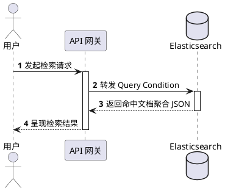
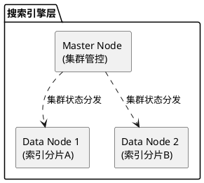

当在 Markdown 文件中生成或编写 PlantUML 图表时，必须严格遵循以下规范：

## 核心原则：基于 Server-Side 渲染的全量语法

我们使用的 Markdown 阅览体系（Markdown Preview Enhanced 插件）已挂载在线公有云服务器（如 `https://www.plantuml.com/plantuml/svg/` 或 `Kroki`），因此彻底解锁了 PlantUML 的全部语法特性。无需降级使用 Mermaid 或简易内置框架。

## 可自由使用的图表类型

- 复杂 ER 实体关联图 (Entity-Relationship Diagram)
- 带高度细节抽象的系统时序图 (Sequence Diagram)
- 带有微服务内外边界标记的组件/部署图 (Component/Deployment Diagram)

## 范例参考

### 时序交互图 (Sequence Diagram)



### 微服务架构组件图 (Component Diagram)



## 生成自检清单

在输出 PlantUML 代码后，必须自行检查以下几点：

1. **统一标示**：在 Markdown 块开始必须保持标准声明 ` ```plantuml `。
2. **闭环规范**：文件内必须用 `@startuml` 和 `@enduml` 把逻辑内容完整包裹，不可缺漏。
3. **中文适应度**：对于描述语句或带有特殊符号的节点别名，坚持使用英文基准命名 (alias)，并在显示文字处使用双引号 `""` 保证中文解析不乱码。

请根据用户的需求，按照以上规范在当前 Markdown 文件中生成 PlantUML 图表。
