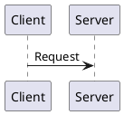
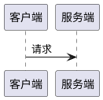

# PlantUML for Markdown 规范

## 目的

标准化在 Markdown 文档中使用 PlantUML 生成图表的方式，确保图表可渲染、可维护且风格统一。

## 核心原则

- **Server-Side 渲染**：利用在线渲染服务器（如 PlantUML Server 或 Kroki），解锁全部 PlantUML 语法特性。
- **Resilient Diagrams**：确保在不安装 Graphviz 的环境下也能通过 IDE 插件正常预览。

## 语法规范

### 1. 块标示

使用 ```` ```plantuml ```` 开启代码块。

### 2. 闭环声明

内容必须由 `@startuml` 和 `@enduml` 包裹。

````markdown

````

### 3. 中文处理

使用英文别名（alias），显示文字使用双引号 `""` 包裹以防乱码。



## 推荐图表类型

### 时序交互图（Sequence Diagram）

代替 Mermaid 处理服务调用栈，适合展示服务间交互流程。

### 组件图（Component Diagram）

展示微服务拓扑和分组关系，适合架构图。

## 自检清单

生成图表后，检查以下要点：

- 是否使用了标准的 `@startuml` 声明？
- 是否在图表前后提供了文字铺垫与总结？
- 节点别名是否为英文？
- 中文显示文字是否用双引号包裹？
