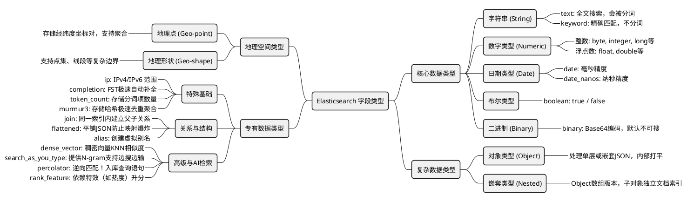

# Elasticsearch 字段类型思维导图与详解

## 思维导图

下面是使用 Mermaid 语法渲染的 Elasticsearch 字段类型思维导图：

---

## 字段类型特点详解

### 一、 核心数据类型 (Core Datatypes)
这些是最基础的标量类型，日常开发最为常用。

*   **字符串类型 (String)**
    *   `text`: 用于**全文搜索**。在建立索引前，字符串会被分词器（Analyzer）拆分成多个独立的词项（Token）。它不支持聚合或聚合排序操作（除非开启 fielddata，但不推荐，耗费内存）。
    *   `keyword`: 用于**精确匹配**、排序、过滤和聚合。输入内容会被当作一个完整的词条整体建立倒排索引，不会进行常规分词。
*   **数字类型 (Numeric)**
    *   **整数类型**: `byte`, `short`, `integer`, `long`, `unsigned_long`。
    *   **浮点类型**: `float`, `double`, `half_float`, `scaled_float`（带有缩放因子的浮点数，底层存为 long 以优化存储）。
    *   **特点**: 专门针对范围查询进行了优化（例如价格比较、大小区间）。
*   **日期类型 (Date)**
    *   `date`: 内部统一存储为自 Epoch（1970-01-01）以来的毫秒数，支持多种传入时间格式解析。
    *   `date_nanos`: 支持纳秒级别精度的日期类型，用于对时间线要求极高的数据。
*   **布尔类型 (Boolean)**
    *   `boolean`: 仅接受 `true` 和 `false`，在内部做特殊词项优化处理。
*   **二进制格式 (Binary)**
    *   `binary`: 接受 Base64 编码的二进制值。默认情况下，这类字段不被索引且不可搜索，仅作为原始内容存储带回。

### 二、 复杂数据类型 (Complex Datatypes)
用于描述包含多个维度或子结构的复杂 JSON 结构。

*   **对象类型 (Object)**
    *   `object`: 可以包含单层或多层级的内部 JSON 对象。在 Lucene 底层，它会被打平（flattened）为包含点的键值对存储（如 `user.name.first`）。它的局限性在于如果不借助 nested，一旦对象进入数组，将**丧失数组元素内部属性间的独立关系**。
*   **嵌套类型 (Nested)**
    *   `nested`: 是 object 的一个特殊化版本。它不仅能保存内部的 JSON 对象层级，而且会将数组里的每个对象当做**独立、隐藏的 Lucene 文档**进行专门索引。这样可以执行严格限定在同一个数组元素内的多条件精确匹配。

### 三、 地理空间数据类型 (Geo Datatypes)
支持基于位置的数据搜索和范围框定。

*   **地理坐标点 (Geo-point)**
    *   `geo_point`: 接受纬度和经度坐标对。可以用于计算距离、对距离进行排序，或者判断某点是否位于一个矩形或圆形内部。
*   **地理形状 (Geo-shape)**
    *   `geo_shape`: 支持复杂的地理形状拓扑（如点集、线段、多边形等），适用于复杂的地理交集、包含与不相交判定关系等。

### 四、 专有数据类型 (Specialised Datatypes)
处理特定的高阶业务需求。

*   **特殊基础用途**
    *   `ip`: 支持存储 IPv4 和 IPv6 地址，可以做极速的 IP 范围限制查找（如 CIDR 块掩码匹配）。
    *   `completion`: 采用有限状态转换器（FST）作为底层数据结构，专为了极高并发下的“输入即提示（Auto-complete/Suggester）”场景设计，性能远超普通查询。
    *   `token_count`: 并不存真实的文本，而是利用分析器分析文本后，**存储生成的词项（Token）个数**。
    *   `murmur3`: 将输入属性做一次 Murmur3 哈希计算并存下 Hash 值，多用于大型系统里的快速去重及基数聚合。
*   **关系与结构控制**
    *   `join`: 允许在同一个索引内部构造不同父子关系映射（比如博客为父文档，评论为子文档），提供超越 Nested 独立性能级的跨文档查询（不过非常消耗性能，官方建议谨慎使用）。
    *   `flattened`: 对于未知字段极多或深层级的 JSON，该类型拔掉它所有的嵌套属性并归入同一个大的 keyword 里，是防弹服级别的“Mapping Explosion（映射爆炸）”防御类型。
    *   `alias`: 定义检索和写入时使用的“字段替身别名”，有助于在重命名底层字段时保证外部 API 平滑兼容。
*   **高级与 AI 向量检索**
    *   `dense_vector`: 用于存储模型算出的浮点型**稠密向量**（ embeddings）。多运用于基于相似度（如 KNN）的向量库检索，是 Elasticsearch 与 NLP 或大模型结合的核心类型。
    *   `search_as_you_type`: 原生类似于 text 解析，但会自动产生大量多种长度的 N-gram（不同字数的分片文本片段），专为实时搜索提供“边搜索边吐出建议补完”的应用场景所内部优化。
    *   `percolator`: 与常规检索方向相反的设计（逆向匹配）！你的“查询语句（DSL）”被当成文档存入了索引，之后当有真实的数据进来时作为查询条件，ES 能够反向推断出这条数据命中了库里的哪些查询规则（绝佳配置于告警、事件订阅引擎）。
    *   `rank_feature` / `rank_features`: 供特定的查询提升评分使用，例如你在商品文档上存一个带有页面排名的数值特征值，搜索时可以按照该特征热度平滑地给相关度分数做 Boost 提权。
