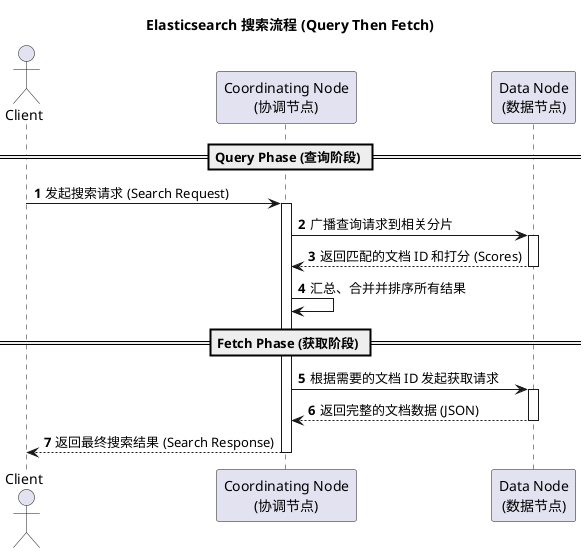

# Elasticsearch 简单查询时序图

以下是一个使用 PlantUML 绘制的 Elasticsearch 简单搜索（Query Then Fetch）流程的时序图示例：



---

## Elasticsearch 项目实施甘特图

以下是一个使用 PlantUML 绘制的简单项目实施甘特图示例：

```plantuml
@startgantt
project starts 2026-03-24

' ========================================
'  全局主题与样式配置 (Flat & Clean UI)
' ========================================
skinparam DefaultFontName "Helvetica Neue", Helvetica, Arial, sans-serif
skinparam BackgroundColor transparent
skinparam Shadowing false
skinparam RoundCorner 8

skinparam Title {
    FontColor #202124
    FontSize 24
    FontStyle bold
    Padding 20
}

skinparam GanttDiagram {
    TaskBackgroundColor #E8F0FE
    TaskBorderColor #1A73E8
    TaskFontColor #1A73E8
    TaskFontName "Helvetica Neue", Helvetica, Arial, sans-serif
    TaskFontSize 13

    MilestoneBackgroundColor #FCE8E6
    MilestoneBorderColor #EA4335
    MilestoneFontColor #EA4335
    MilestoneFontSize 14
    MilestoneFontStyle bold

    ArrowColor #DADCE0
    ArrowThickness 1.5
    
    ClosedBackgroundColor #F8F9FA
    TimelineBackgroundColor transparent
    TimelineFontColor #5F6368
}

' ========================================
'  项目日历配置
' ========================================
saturday are closed
sunday are closed

' ========================================
'  任务详细规划
' ========================================
title ❖ Elasticsearch 企业级项目实施全景视图

' --- 阶段一 ---
group 第一阶段：架构与基石 (Foundation)
    [需求规格说明与架构设计] as [Req] lasts 5 days
    [Req] is colored in #E8F0FE
    [业务数据模型抽象与设计] as [Model] lasts 4 days
    [Model] starts at [Req]'s end
    [Model] is colored in #E8F0FE
    [环境搭建与生产集群配置] as [Env] lasts 3 days
    [Env] starts at [Req]'s end
    [Env] is colored in #CEEAD6
end group

' --- 阶段二 ---
group 第二阶段：核心工程开发 (Engineering)
    [离线与实时数据同步管道建设] as [ETL] lasts 8 days
    [ETL] starts at [Model]'s end
    [ETL] is colored in #FFF0D1
    [ETL] is 30% completed
    [复杂查询DSL设计与API服务] as [API] lasts 7 days
    [API] starts at [ETL]'s start
    [API] is colored in #FFF0D1
    [API] is 15% completed
end group

' --- 阶段三 ---
group 第三阶段：效能调优与交付 (Delivery)
    [海量数据压测与JVM调优] as [Test] lasts 5 days
    [Test] starts at [API]'s end
    [Test] is colored in #FAD2CF
    [灰度发布与生产环境上线] as [Deploy] lasts 2 days
    [Deploy] starts at [Test]'s end
    [Deploy] is colored in #FAD2CF
end group

' ========================================
'  里程碑定义
' ========================================
[基础设施准备就绪] happens at [Env]'s end
[核心接口集成完毕] happens at [API]'s end
[🎉 项目正式交付使用] happens at [Deploy]'s end

@endgantt
```
