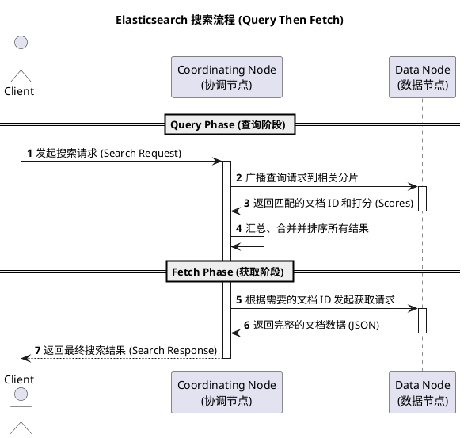

# Elasticsearch 简单查询时序图

以下是一个使用 PlantUML 绘制的 Elasticsearch 简单搜索（Query Then Fetch）流程的时序图示例：

```plantuml
@startuml
title Elasticsearch 搜索流程 (Query Then Fetch)
autonumber

actor "Client" as client
participant "Coordinating Node\n(协调节点)" as coord
participant "Data Node\n(数据节点)" as data

== Query Phase (查询阶段) ==
client -> coord : 发起搜索请求 (Search Request)
activate coord

coord -> data : 广播查询请求到相关分片
activate data
data --> coord : 返回匹配的文档 ID 和打分 (Scores)
deactivate data

coord -> coord : 汇总、合并并排序所有结果

== Fetch Phase (获取阶段) ==
coord -> data : 根据需要的文档 ID 发起获取请求
activate data
data --> coord : 返回完整的文档数据 (JSON)
deactivate data

coord --> client : 返回最终搜索结果 (Search Response)
deactivate coord
@enduml
```

---

## Elasticsearch 项目实施甘特图

以下是一个使用 PlantUML 绘制的简单项目实施甘特图示例：
